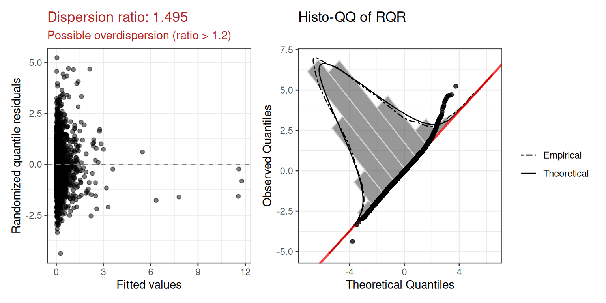
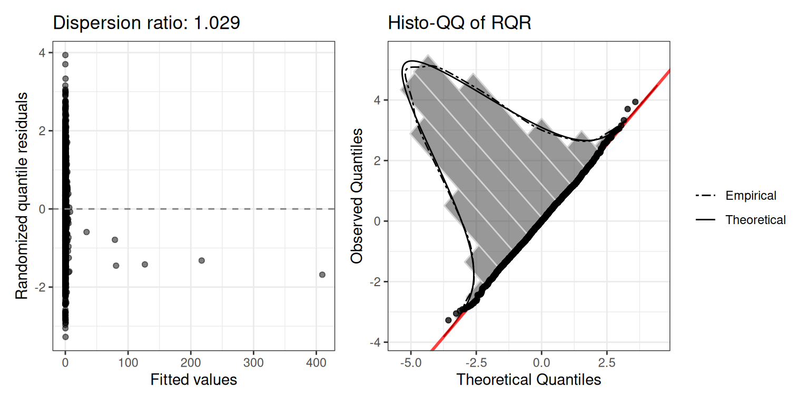

# glmOJ: Count Regression Modeling

``` r
library(glmOJ)
```

## Overview

`glmOJ` provides a streamlined workflow for fitting, diagnosing, and
interpreting count regression models. The four supported families are:

| Function                                                                                 | Model                           |
|------------------------------------------------------------------------------------------|---------------------------------|
| [`poissonGLM()`](http://oscar.jaroker.com/glmOJ/reference/poissonGLM.md)                 | Poisson GLM                     |
| [`negbinGLM()`](http://oscar.jaroker.com/glmOJ/reference/negbinGLM.md)                   | Negative Binomial GLM           |
| [`zeroinflPoissonGLM()`](http://oscar.jaroker.com/glmOJ/reference/zeroinflPoissonGLM.md) | Zero-Inflated Poisson           |
| [`zeroinflNegbinGLM()`](http://oscar.jaroker.com/glmOJ/reference/zeroinflNegbinGLM.md)   | Zero-Inflated Negative Binomial |

A general-purpose wrapper
[`countGLM()`](http://oscar.jaroker.com/glmOJ/reference/countGLM.md)
fits all four and selects the best by AIC.

------------------------------------------------------------------------

## Case Study: Federal Environmental Crime Prosecutions

Greenberg et al. (2026) investigate how environmental and social factors
influence where EPA criminal prosecutions occur across 3,143 US counties
(2011–2020). The response variable `FinalEC` is a count of criminal
prosecutions per county.

``` r
data("Greenberg26.dat")
```

### 1. Data Exploration

Before fitting,
[`summarizeCountData()`](http://oscar.jaroker.com/glmOJ/reference/summarizeCountData.md)
gives a quick numerical and graphical overview of the count response
alongside each predictor.

``` r
summarizeCountData(
  FinalEC ~ eqi_2jan2018_vc +
    pctnonwhite10 +
    metro +
    gdp2017b +
    fac_penalty_count +
    CIDDist +
    EPAregion,
  data = Greenberg26.dat
)
#> $summary
#>        mean       var var_mean_ratio n_zero n_total
#> 1 0.2356564 0.6490525       2.754232   2654    3085
#> 
#> $counts
#>    count freq
#> 1      0 2654
#> 2      1  299
#> 3      2   66
#> 4      3   31
#> 5      4   14
#> 6      5    5
#> 7      6    6
#> 8      7    3
#> 9      8    3
#> 10     9    2
#> 11    11    1
#> 12    12    1
#> 
#> $plot
```


### 2. Poisson Regression

We first fit a Poisson GLM with the Overall Environmental Quality Index
and demographic/geographic controls.

``` r
mod.pois <- poissonGLM(
  FinalEC ~ eqi_2jan2018_vc +
    pctnonwhite10 +
    metro +
    gdp2017b +
    fac_penalty_count +
    CIDDist +
    EPAregion,
  data = Greenberg26.dat
)
```

#### Coefficients (exponentiated)

``` r
mod.pois$coefficients
#>                 term  exp.coef  lower.95  upper.95
#> 1        (Intercept) 0.1823719 0.1218639 0.2729236
#> 2    eqi_2jan2018_vc 1.0587100 0.9554459 1.1731349
#> 3      pctnonwhite10 1.0193442 1.0149745 1.0237327
#> 4             metro1 3.3042257 2.7087270 4.0306415
#> 5           gdp2017b 1.0020768 1.0013743 1.0027798
#> 6  fac_penalty_count 1.0035038 1.0025814 1.0044270
#> 7            CIDDist 0.9968844 0.9961277 0.9976416
#> 8         EPAregion2 0.6380126 0.4071818 0.9997010
#> 9         EPAregion3 0.3930124 0.2500571 0.6176939
#> 10        EPAregion4 0.3419217 0.2283596 0.5119578
#> 11        EPAregion5 0.6331705 0.4259880 0.9411178
#> 12        EPAregion6 0.3535927 0.2288448 0.5463433
#> 13        EPAregion7 0.9194406 0.6000503 1.4088336
#> 14        EPAregion8 0.9845458 0.6244062 1.5524036
#> 15        EPAregion9 0.6802879 0.4344711 1.0651838
#> 16       EPAregion10 1.6355984 1.0812709 2.4741092
```

#### Model fit

``` r
mod.pois$diagnostics$plot
```


The dispersion ratio of 1.615 is flagged in red — the observed variance
is ~60% larger than expected under Poisson, suggesting overdispersion.
We also inspect the squared Pearson residual plot:

``` r
mod.pois$diagnostics$r2_plot
```


The wedge shape confirms the mean-variance relationship is not well
captured by the Poisson assumption.

### 3. Negative Binomial Regression (Model 1b)

The negative binomial adds a free dispersion parameter $\theta$ to
handle overdispersion.

``` r
mod.nb <- negbinGLM(
  FinalEC ~ eqi_2jan2018_vc +
    pctnonwhite10 +
    metro +
    gdp2017b +
    fac_penalty_count +
    CIDDist +
    EPAregion,
  data = Greenberg26.dat,
  control = stats::glm.control(maxit = 100)
)
```

#### Coefficients (exponentiated)

``` r
mod.nb$coefficients
#>                 term  exp.coef  lower.95  upper.95
#> 1        (Intercept) 0.1739476 0.1009294 0.2997917
#> 2    eqi_2jan2018_vc 0.9876521 0.8594207 1.1350166
#> 3      pctnonwhite10 1.0142370 1.0081961 1.0203142
#> 4             metro1 2.6619963 2.0970839 3.3790847
#> 5           gdp2017b 1.0075352 1.0053273 1.0097479
#> 6  fac_penalty_count 1.0095626 1.0068424 1.0122902
#> 7            CIDDist 0.9980886 0.9971817 0.9989964
#> 8         EPAregion2 0.7248601 0.3804835 1.3809327
#> 9         EPAregion3 0.3342143 0.1793891 0.6226643
#> 10        EPAregion4 0.3282850 0.1881526 0.5727855
#> 11        EPAregion5 0.5182600 0.2972138 0.9037044
#> 12        EPAregion6 0.3174128 0.1737298 0.5799287
#> 13        EPAregion7 0.7815558 0.4357070 1.4019271
#> 14        EPAregion8 0.9084431 0.4852015 1.7008789
#> 15        EPAregion9 0.5513771 0.2775557 1.0953358
#> 16       EPAregion10 1.6502074 0.8996619 3.0268976
```

#### Model fit

``` r
mod.nb$diagnostics$plot
```


``` r
mod.nb$diagnostics$r2_plot
```


The dispersion ratio is now 1.021 — much closer to 1. The estimated
$\theta$ is 0.649.

### 4. Comparing Models: Likelihood Ratio Test

Because the Poisson model is nested within the negative binomial
(Poisson is NB with $\left. \theta\rightarrow\infty \right.$), we can
use a likelihood ratio test. The underlying `glm`/`glm.nb` fit objects
are available via `$model`:

``` r
lmtest::lrtest(mod.pois$model, mod.nb$model)
#> Likelihood ratio test
#> 
#> Model 1: FinalEC ~ eqi_2jan2018_vc + pctnonwhite10 + metro + gdp2017b + 
#>     fac_penalty_count + CIDDist + EPAregion
#> Model 2: FinalEC ~ eqi_2jan2018_vc + pctnonwhite10 + metro + gdp2017b + 
#>     fac_penalty_count + CIDDist + EPAregion
#>   #Df  LogLik Df  Chisq Pr(>Chisq)    
#> 1  16 -1573.7                         
#> 2  17 -1465.2  1 217.13  < 2.2e-16 ***
#> ---
#> Signif. codes:  0 '***' 0.001 '**' 0.01 '*' 0.05 '.' 0.1 ' ' 1
```

The negative binomial model is significantly better ($p < 0.0001$),
confirming that overdispersion is a genuine problem for the Poisson fit.

### 5. Poisson Regression with Specific Quality Indices

The researchers also evaluated whether separate Water, Air, Land, and
Socioeconomic indices were more informative than the composite Overall
EQI.

``` r
mod.pois2 <- poissonGLM(
  FinalEC ~ water_eqi_2jan2018_vc +
    land_eqi_2jan2018_vc +
    air_eqi_2jan2018_vc +
    sociod_eqi_2jan2018_vc +
    pctnonwhite10 +
    metro +
    gdp2017b +
    fac_penalty_count +
    CIDDist +
    EPAregion,
  data = Greenberg26.dat
)

mod.pois2$diagnostics$plot
```



Dispersion ratio: 1.495 — again flagging overdispersion.

### 6. Negative Binomial with Specific Quality Indices

``` r
mod.nb2 <- negbinGLM(
  FinalEC ~ water_eqi_2jan2018_vc +
    land_eqi_2jan2018_vc +
    air_eqi_2jan2018_vc +
    sociod_eqi_2jan2018_vc +
    pctnonwhite10 +
    metro +
    gdp2017b +
    fac_penalty_count +
    CIDDist +
    EPAregion,
  data = Greenberg26.dat,
  control = stats::glm.control(maxit = 100)
)

mod.nb2$diagnostics$plot
```



Dispersion ratio: 1.029.

------------------------------------------------------------------------

## References

Greenberg, Pierce, Erik W Johnson, Jennifer Schwartz, and Rylie
Wartinger. 2026. “Social Factors Shape Federal Environmental Crime
Prosecution Patterns in the USA.” *Nature Sustainability*, 1–5.
