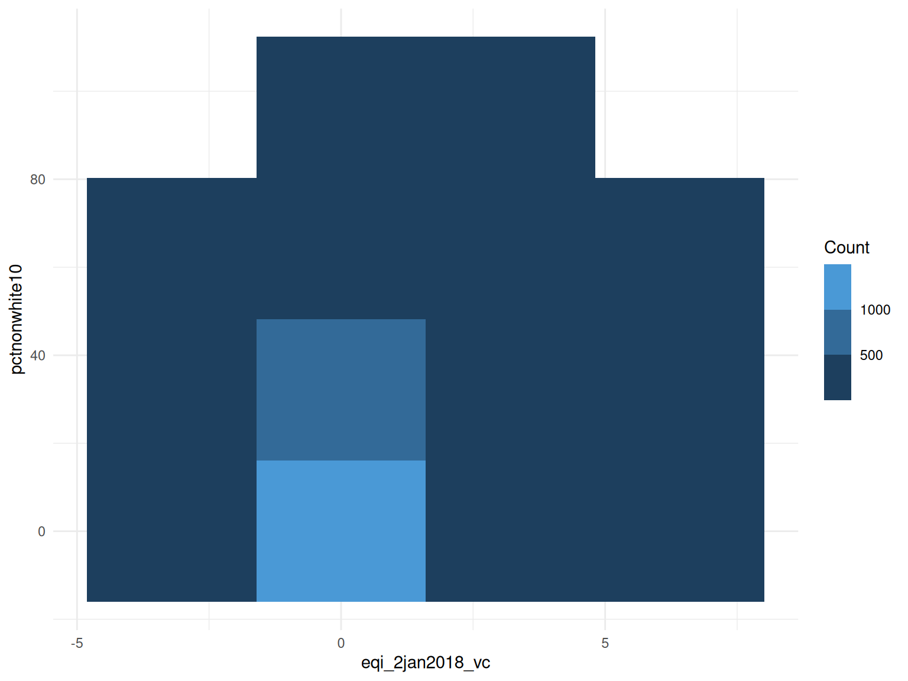
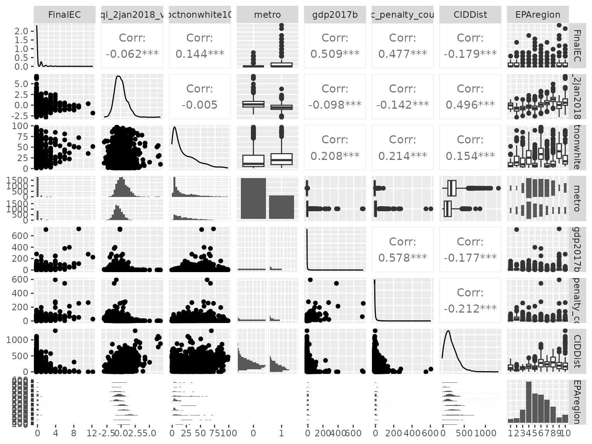
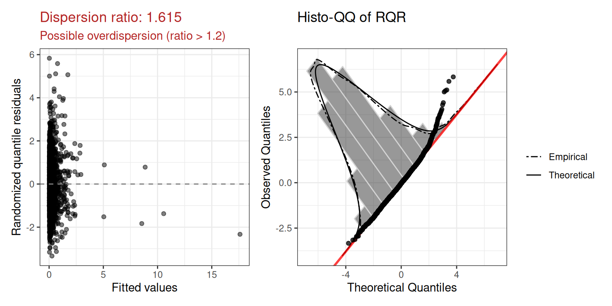
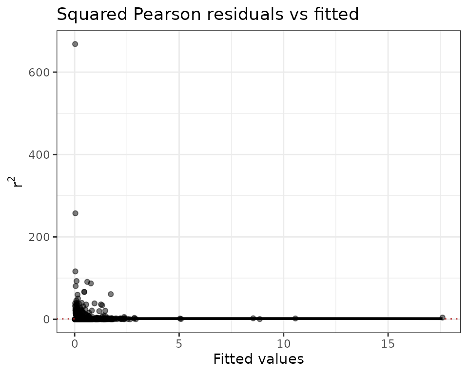
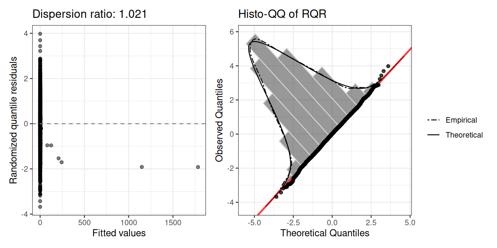
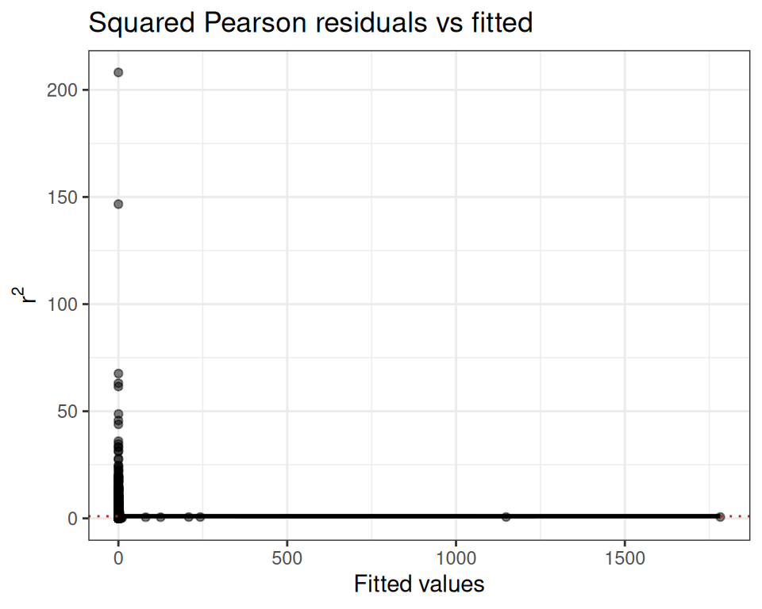
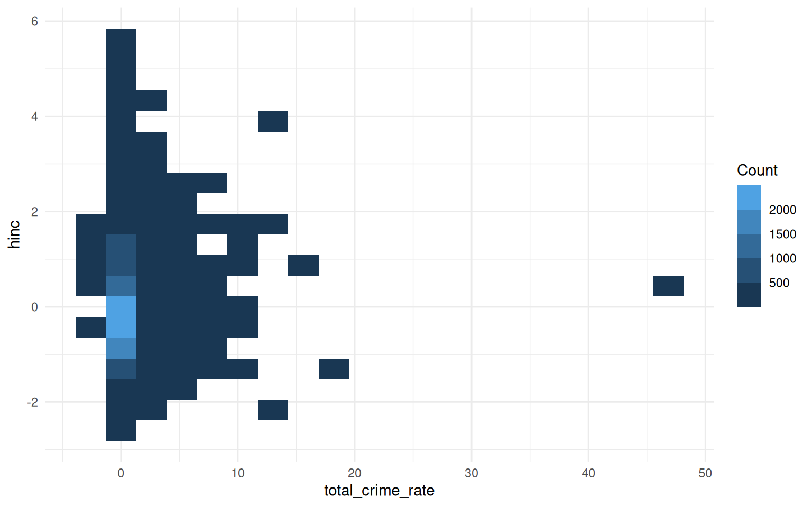
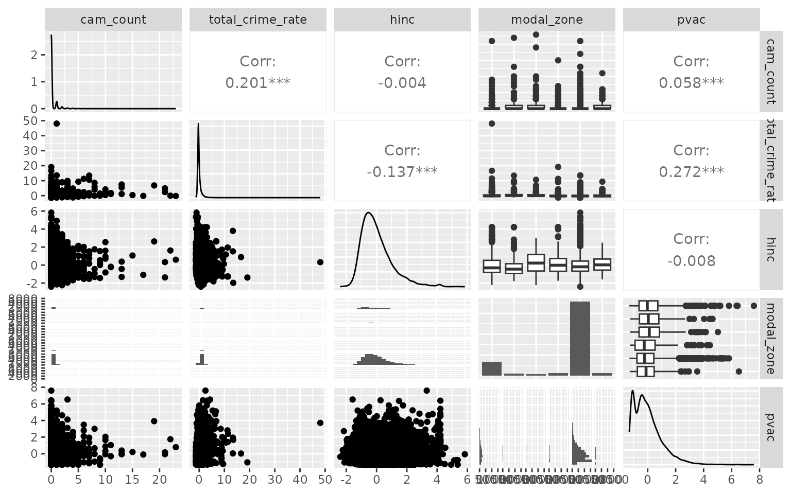
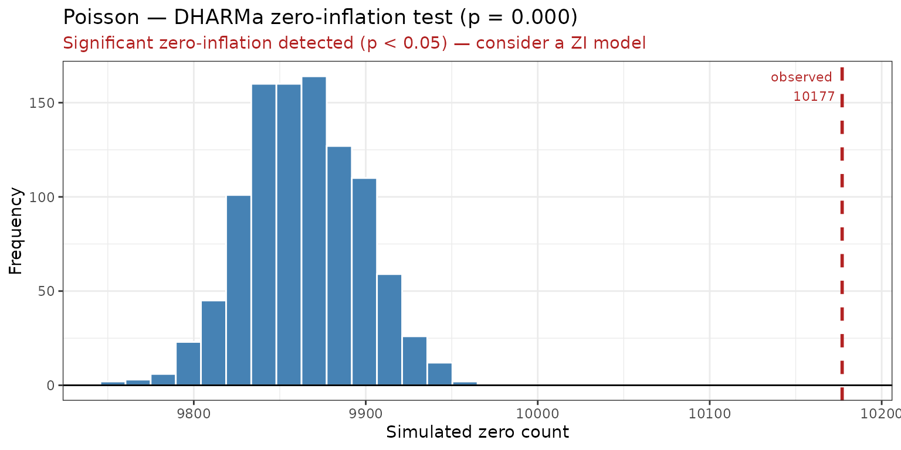

# glmOJ: Count Regression Modeling

``` r
library(glmOJ)
```

## Overview

`glmOJ` provides a streamlined workflow for fitting, diagnosing, and
interpreting count regression models. The four supported families are:

| Function                                                                                 | Model                           |
|------------------------------------------------------------------------------------------|---------------------------------|
| [`poissonGLM()`](http://oscar.jaroker.com/glmOJ/reference/poissonGLM.md)                 | Poisson GLM                     |
| [`negbinGLM()`](http://oscar.jaroker.com/glmOJ/reference/negbinGLM.md)                   | Negative Binomial GLM           |
| [`zeroinflPoissonGLM()`](http://oscar.jaroker.com/glmOJ/reference/zeroinflPoissonGLM.md) | Zero-Inflated Poisson           |
| [`zeroinflNegbinGLM()`](http://oscar.jaroker.com/glmOJ/reference/zeroinflNegbinGLM.md)   | Zero-Inflated Negative Binomial |

A general-purpose wrapper
[`countGLM()`](http://oscar.jaroker.com/glmOJ/reference/countGLM.md)
fits all four and selects the best by a user-chosen criterion
(`decide`): `"BIC"` (default), `"AIC"`, `"LogLik"`, or `"McFadden"`
(McFadden pseudo-R²).

------------------------------------------------------------------------

## Case Study: Federal Environmental Crime Prosecutions

Greenberg et al. (2026) investigate how environmental and social factors
influence where EPA criminal prosecutions occur across 3,143 US counties
(2011–2020). The response variable `FinalEC` is a count of criminal
prosecutions per county.

``` r
data("Greenberg26.dat")
```

### 1. Data Exploration

Before fitting,
[`summarizeCountData()`](http://oscar.jaroker.com/glmOJ/reference/summarizeCountData.md)
gives a quick numerical and graphical overview of the count response
alongside each predictor.

``` r
summarizeCountData(
  FinalEC ~ eqi_2jan2018_vc +
    pctnonwhite10 +
    metro +
    gdp2017b +
    fac_penalty_count +
    CIDDist +
    EPAregion,
  data = Greenberg26.dat
)
#> $summary
#>        mean       var var_mean_ratio n_zero n_total
#> 1 0.2356564 0.6490525       2.754232   2654    3085
#> 
#> $counts
#>    count freq
#> 1      0 2654
#> 2      1  299
#> 3      2   66
#> 4      3   31
#> 5      4   14
#> 6      5    5
#> 7      6    6
#> 8      7    3
#> 9      8    3
#> 10     9    2
#> 11    11    1
#> 12    12    1
#> 
#> $plot
```



    #> 
    #> $pairs_plot



### 2. Poisson Regression

We first fit a Poisson GLM with the Overall Environmental Quality Index
and demographic/geographic controls.

``` r
mod.pois <- poissonGLM(
  FinalEC ~ eqi_2jan2018_vc +
    pctnonwhite10 +
    metro +
    gdp2017b +
    fac_penalty_count +
    CIDDist +
    EPAregion,
  data = Greenberg26.dat
)
```

#### Coefficients (exponentiated)

``` r
mod.pois$coefficients
#>                 term  exp.coef  lower.95  upper.95      p.value stars
#> 1        (Intercept) 0.1823719 0.1218639 0.2729236 1.304191e-16   ***
#> 2    eqi_2jan2018_vc 1.0587100 0.9554459 1.1731349 2.759131e-01      
#> 3      pctnonwhite10 1.0193442 1.0149745 1.0237327 2.308798e-18   ***
#> 4             metro1 3.3042257 2.7087270 4.0306415 4.500518e-32   ***
#> 5           gdp2017b 1.0020768 1.0013743 1.0027798 6.708917e-09   ***
#> 6  fac_penalty_count 1.0035038 1.0025814 1.0044270 9.019065e-14   ***
#> 7            CIDDist 0.9968844 0.9961277 0.9976416 7.995795e-16   ***
#> 8         EPAregion2 0.6380126 0.4071818 0.9997010 4.984764e-02     *
#> 9         EPAregion3 0.3930124 0.2500571 0.6176939 5.159508e-05   ***
#> 10        EPAregion4 0.3419217 0.2283596 0.5119578 1.880591e-07   ***
#> 11        EPAregion5 0.6331705 0.4259880 0.9411178 2.381632e-02     *
#> 12        EPAregion6 0.3535927 0.2288448 0.5463433 2.826577e-06   ***
#> 13        EPAregion7 0.9194406 0.6000503 1.4088336 6.996862e-01      
#> 14        EPAregion8 0.9845458 0.6244062 1.5524036 9.465543e-01      
#> 15        EPAregion9 0.6802879 0.4344711 1.0651838 9.219375e-02     .
#> 16       EPAregion10 1.6355984 1.0812709 2.4741092 1.980635e-02     *
```

#### Model fit

``` r
mod.pois$diagnostics$plot
```



The dispersion ratio of 1.615 is flagged in red — the observed variance
is ~60% larger than expected under Poisson, suggesting overdispersion.
We also inspect the squared Pearson residual plot:

``` r
mod.pois$diagnostics$r2_plot
```



The wedge shape confirms the mean-variance relationship is not well
captured by the Poisson assumption.

### 3. Negative Binomial Regression

The negative binomial adds a free dispersion parameter $\theta$ to
handle overdispersion.

``` r
mod.nb <- negbinGLM(
  FinalEC ~ eqi_2jan2018_vc +
    pctnonwhite10 +
    metro +
    gdp2017b +
    fac_penalty_count +
    CIDDist +
    EPAregion,
  data = Greenberg26.dat,
  control = stats::glm.control(maxit = 100)
)
```

#### Coefficients (exponentiated)

``` r
mod.nb$coefficients
#>                 term  exp.coef  lower.95  upper.95      p.value stars
#> 1        (Intercept) 0.1739476 0.1009294 0.2997917 3.023453e-10   ***
#> 2    eqi_2jan2018_vc 0.9876521 0.8594207 1.1350166 8.609982e-01      
#> 3      pctnonwhite10 1.0142370 1.0081961 1.0203142 3.518093e-06   ***
#> 4             metro1 2.6619963 2.0970839 3.3790847 8.626855e-16   ***
#> 5           gdp2017b 1.0075352 1.0053273 1.0097479 1.988481e-11   ***
#> 6  fac_penalty_count 1.0095626 1.0068424 1.0122902 4.726959e-12   ***
#> 7            CIDDist 0.9980886 0.9971817 0.9989964 3.709074e-05   ***
#> 8         EPAregion2 0.7248601 0.3804835 1.3809327 3.278330e-01      
#> 9         EPAregion3 0.3342143 0.1793891 0.6226643 5.559635e-04   ***
#> 10        EPAregion4 0.3282850 0.1881526 0.5727855 8.778317e-05   ***
#> 11        EPAregion5 0.5182600 0.2972138 0.9037044 2.051048e-02     *
#> 12        EPAregion6 0.3174128 0.1737298 0.5799287 1.901195e-04   ***
#> 13        EPAregion7 0.7815558 0.4357070 1.4019271 4.083921e-01      
#> 14        EPAregion8 0.9084431 0.4852015 1.7008789 7.641150e-01      
#> 15        EPAregion9 0.5513771 0.2775557 1.0953358 8.914123e-02     .
#> 16       EPAregion10 1.6502074 0.8996619 3.0268976 1.055884e-01
```

#### Model fit

``` r
mod.nb$diagnostics$plot
```



``` r
mod.nb$diagnostics$r2_plot
```



The dispersion ratio is now 1.021 — much closer to 1. The estimated
$\theta$ is 0.649.

### 4. Comparing Models: Likelihood Ratio Test

Because the Poisson model is nested within the negative binomial
(Poisson is NB with $\left. \theta\rightarrow\infty \right.$), we can
use a likelihood ratio test. The underlying `glm`/`glm.nb` fit objects
are available via `$model`:

``` r
lmtest::lrtest(mod.pois$model, mod.nb$model)
#> Likelihood ratio test
#> 
#> Model 1: FinalEC ~ eqi_2jan2018_vc + pctnonwhite10 + metro + gdp2017b + 
#>     fac_penalty_count + CIDDist + EPAregion
#> Model 2: FinalEC ~ eqi_2jan2018_vc + pctnonwhite10 + metro + gdp2017b + 
#>     fac_penalty_count + CIDDist + EPAregion
#>   #Df  LogLik Df  Chisq Pr(>Chisq)    
#> 1  16 -1573.7                         
#> 2  17 -1465.2  1 217.13  < 2.2e-16 ***
#> ---
#> Signif. codes:  0 '***' 0.001 '**' 0.01 '*' 0.05 '.' 0.1 ' ' 1
```

The negative binomial model is significantly better ($p < 0.0001$),
confirming that overdispersion is a genuine problem for the Poisson fit.

### 5. Using the `countGLM` Wrapper

Rather than fitting each model manually,
[`countGLM()`](http://oscar.jaroker.com/glmOJ/reference/countGLM.md)
fits all four families at once and selects the best by the criterion
specified in `decide` (default `"BIC"`) — arriving at the same
conclusion automatically.

#### Overall EQI formula

``` r
result1 <- countGLM(
  FinalEC ~ eqi_2jan2018_vc +
    pctnonwhite10 +
    metro +
    gdp2017b +
    fac_penalty_count +
    CIDDist +
    EPAregion,
  data = Greenberg26.dat
)
print(result1)
#> 
#> Call:
#> countGLM(formula = FinalEC ~ eqi_2jan2018_vc + pctnonwhite10 + 
#>     metro + gdp2017b + fac_penalty_count + CIDDist + EPAregion, 
#>     data = Greenberg26.dat)
#> 
#> Model comparison (sorted by BIC (ascending)):
#>    model     AIC    BIC
#>   negbin 2964.32 3066.9
#>  poisson 3179.45 3276.0
#> 
#> Selected model: negbin
#> 
#> Recommendation:
#>   Negative Binomial was selected by BIC (BIC = 3066.90). The Poisson
#>   dispersion ratio is 1.62 (> 1.5), indicating overdispersion. DHARMa
#>   zero-inflation test is significant for the Poisson fit (p = 0.000)
#>   but not for the Negative Binomial fit (p = 0.654); excess zeros may
#>   be explained by overdispersion alone.
```

The wrapper selects the same winner as the manual LRT. Individual fits
remain accessible: `result1$fits$negbin`, `result1$fits$poisson`, etc.

#### Sub-index formula

The researchers also evaluated whether separate Water, Air, Land, and
Socioeconomic indices were more informative than the composite Overall
EQI. `countGLM` handles this in one call:

``` r
result2 <- countGLM(
  FinalEC ~ water_eqi_2jan2018_vc +
    land_eqi_2jan2018_vc +
    air_eqi_2jan2018_vc +
    sociod_eqi_2jan2018_vc +
    pctnonwhite10 +
    metro +
    gdp2017b +
    fac_penalty_count +
    CIDDist +
    EPAregion,
  data = Greenberg26.dat
)
print(result2)
#> 
#> Call:
#> countGLM(formula = FinalEC ~ water_eqi_2jan2018_vc + land_eqi_2jan2018_vc + 
#>     air_eqi_2jan2018_vc + sociod_eqi_2jan2018_vc + pctnonwhite10 + 
#>     metro + gdp2017b + fac_penalty_count + CIDDist + EPAregion, 
#>     data = Greenberg26.dat)
#> 
#> Model comparison (sorted by BIC (ascending)):
#>    model     AIC     BIC
#>   negbin 2953.72 3074.41
#>  poisson 3144.98 3259.64
#> 
#> Selected model: negbin
#> 
#> Recommendation:
#>   Negative Binomial was selected by BIC (BIC = 3074.41). The Poisson
#>   dispersion ratio is 1.49, consistent with equidispersion. DHARMa
#>   zero-inflation test is significant for the Poisson fit (p = 0.000)
#>   but not for the Negative Binomial fit (p = 0.828); excess zeros may
#>   be explained by overdispersion alone.
```

Again the negative binomial is selected. The non-nested comparison
between these two winning models (overall EQI vs sub-indices) can be
done with a Vuong test via
`nonnest2::vuongtest(result1$fits$negbin$model, result2$fits$negbin$model)`.

------------------------------------------------------------------------

## 6. Coefficient Interpretation

[`interpret_coef()`](http://oscar.jaroker.com/glmOJ/reference/interpret_coef.md)
translates any exponentiated coefficient into a plain-language
statement, with a 95% CI and an automatic note when the predictor is not
discernible from zero (p \> 0.05).

#### Significant predictor

``` r
interpret_coef(mod.nb, "pctnonwhite10")
#> Holding all other predictors constant, a one-unit increase in pctnonwhite10 is associated with a 1.4% increase in the expected count of FinalEC (exp(β) = 1.014, 95% CI: [1.008, 1.020]).
```

#### Non-significant predictor

``` r
interpret_coef(mod.nb, "eqi_2jan2018_vc")
#> Holding all other predictors constant, a one-unit increase in eqi_2jan2018_vc is associated with a 1.2% decrease in the expected count of FinalEC (exp(β) = 0.988, 95% CI: [0.859, 1.135]).
#> Note: this coefficient is not discernibly different from zero (p = 0.861).
```

The note about discernibility is added automatically.

#### Using with `countGLM`

Pass the `countGLM` result directly — it delegates to the best-fitting
model:

``` r
interpret_coef(result2, "pctnonwhite10")
#> Holding all other predictors constant, a one-unit increase in pctnonwhite10 is associated with a 1.4% increase in the expected count of FinalEC (exp(β) = 1.014, 95% CI: [1.008, 1.020]).
```

#### Zero-inflated models: specifying the component

For zero-inflated models, use `component = "count"` (default) or
`component = "zero"`:

``` r
interpret_coef(zi_fit, "pctnonwhite10", component = "count")
interpret_coef(zi_fit, "pctnonwhite10", component = "zero")
```

------------------------------------------------------------------------

## Case Study 2: Urban Surveillance Camera Counts (Dahir 2025)

Dahir (2025) models the number of surveillance cameras per census tract
across ten US cities. The response `cam_count` is a non-negative integer
with 87.6% zeros and a variance-to-mean ratio of approximately 3.6 —
classic signs of both excess zeros and overdispersion.

``` r
data("Dahir25.dat")
```

### 7. Data Exploration

``` r
summarizeCountData(
  cam_count ~ total_crime_rate + hinc + modal_zone + pvac,
  data = Dahir25.dat
)
#> $summary
#>        mean       var var_mean_ratio n_zero n_total
#> 1 0.2172117 0.7840397       3.609565  10177   11620
#> 
#> $counts
#>    count  freq
#> 1      0 10177
#> 2      1   977
#> 3      2   257
#> 4      3    97
#> 5      4    44
#> 6      5    20
#> 7      6    14
#> 8      7     8
#> 9      8     4
#> 10     9     5
#> 11    10     5
#> 12    11     2
#> 13    13     3
#> 14    15     1
#> 15    17     1
#> 16    19     1
#> 17    21     2
#> 18    22     1
#> 19    23     1
#> 
#> $plot
```



    #> 
    #> $pairs_plot



The summary table makes the issue concrete: the variance-to-mean ratio
far exceeds 1 and the frequency table is dominated by zeros. Camera
placement varies substantially by land-use zone — mixed and industrial
tracts have cameras in roughly 28–42% of cases, while residential tracts
(the majority, n = 8913) have cameras in fewer than 10%. This mixture of
structurally camera-free tracts alongside genuinely high-count
commercial zones is exactly the setting where zero-inflated or
overdispersed count models are needed.

### 8. Poisson and Zero-Inflated Poisson

We may want to start by manually fitting a Poisson model to confirm the
overdispersion and zero-inflation diagnostics. The formula includes a
quadratic term for each predictor to allow for non-linear effects, and
road length is included as an offset:

``` r
pois.cam <- poissonGLM(
  cam_count ~ pnhwht +
    pnhblk +
    entropy_rank +
    total_crime_rate +
    modal_zone +
    pop +
    hinc +
    pvac +
    mhmval +
    city +
    offset(log_road_length) +
    I(pnhwht^2) +
    I(pnhblk^2) +
    I(entropy_rank^2),
  data = Dahir25.dat
)
print(pois.cam)
#> 
#> Call:
#> poissonGLM(formula = cam_count ~ pnhwht + pnhblk + entropy_rank + 
#>     total_crime_rate + modal_zone + pop + hinc + pvac + mhmval + 
#>     city + offset(log_road_length) + I(pnhwht^2) + I(pnhblk^2) + 
#>     I(entropy_rank^2), data = Dahir25.dat)
#> 
#> Model family: poissonGLM 
#> 
#> Coefficients (on response scale):
#>                   term exp.coef lower.95 upper.95 p.value stars
#>            (Intercept)   0.1337   0.1055   0.1695  0.0000   ***
#>                 pnhwht   0.9634   0.8968   1.0349  0.3067      
#>                 pnhblk   0.8723   0.8106   0.9387  0.0003   ***
#>           entropy_rank   1.4478   0.7754   2.7031  0.2454      
#>       total_crime_rate   1.0908   1.0796   1.1022  0.0000   ***
#>   modal_zoneindustrial   1.1534   0.9558   1.3917  0.1366      
#>        modal_zonemixed   1.2535   1.0415   1.5087  0.0168     *
#>       modal_zonepublic   0.5876   0.4649   0.7428  0.0000   ***
#>  modal_zoneresidential   0.4298   0.3742   0.4937  0.0000   ***
#>        modal_zoneroads   0.6960   0.4447   1.0895  0.1130      
#>                    pop   1.1213   1.0990   1.1442  0.0000   ***
#>                   hinc   0.7716   0.7305   0.8149  0.0000   ***
#>                   pvac   1.1807   1.1373   1.2258  0.0000   ***
#>                 mhmval   1.1586   1.1036   1.2164  0.0000   ***
#>             cityBoston   1.2368   1.0563   1.4481  0.0083    **
#>            cityChicago   0.1851   0.1546   0.2216  0.0000   ***
#>        cityLos Angeles   0.0495   0.0399   0.0615  0.0000   ***
#>          cityMilwaukee   0.3249   0.2688   0.3927  0.0000   ***
#>           cityNew York   0.2073   0.1776   0.2421  0.0000   ***
#>       cityPhiladelphia   0.4482   0.3808   0.5274  0.0000   ***
#>      citySan Francisco   0.6071   0.5090   0.7241  0.0000   ***
#>            citySeattle   0.1768   0.1440   0.2171  0.0000   ***
#>         cityWashington   0.4568   0.3008   0.6937  0.0002   ***
#>            I(pnhwht^2)   1.0487   0.9979   1.1020  0.0607     .
#>            I(pnhblk^2)   1.0139   0.9881   1.0402  0.2939      
#>      I(entropy_rank^2)   1.2363   0.7094   2.1546  0.4541      
#> 
#> Dispersion ratio: 1.8401
#> AIC: 11299.96
```

The DHARMa zero-inflation test result:

``` r
zi <- pois.cam$diagnostics$zi_test
cat(sprintf(
  "DHARMa zero-inflation test: p = %.4f  |  Detected: %s\n",
  zi$p_value,
  zi$detected
))
#> DHARMa zero-inflation test: p = 0.0000  |  Detected: TRUE
zi$plot
```



### 8. Automatic Model Selection with `countGLM`

[`countGLM()`](http://oscar.jaroker.com/glmOJ/reference/countGLM.md)
fits all four count families and selects the best by the criterion in
`decide` (default `"BIC"`). Road length (`log_road_length`) is included
as an offset in the count component; because `ziformula = NULL`, it is
automatically applied to the zero-inflation component as well —
`countGLM` prints a note confirming this:

``` r
result_cam <- countGLM(
  cam_count ~ pnhblk +
    pnhwht +
    total_crime_rate +
    hinc +
    pvac +
    modal_zone +
    offset(log_road_length),
  data = Dahir25.dat
)
print(result_cam)
#> 
#> Call:
#> countGLM(formula = cam_count ~ pnhblk + pnhwht + total_crime_rate + 
#>     hinc + pvac + modal_zone + offset(log_road_length), data = Dahir25.dat)
#> 
#> Model comparison (sorted by BIC (ascending)):
#>   model      AIC      BIC
#>  negbin 11306.16 11394.49
#> 
#> Selected model: negbin
#> 
#> Recommendation:
#>   Negative Binomial was selected by BIC (BIC = 11394.49).
```

The comparison table shows AIC and BIC for all four families, sorted by
the selection criterion. The selected model is **negbin**. The
recommendation captures the relevant dispersion and zero-inflation
diagnostics automatically, explaining why this family was preferred.

### 9. Interpreting the Winning Model

[`interpret_coef()`](http://oscar.jaroker.com/glmOJ/reference/interpret_coef.md)
delegates to the best-fitting model automatically:

``` r
interpret_coef(result_cam, "total_crime_rate")
#> Holding all other predictors constant, a one-unit increase in total_crime_rate is associated with a 39.2% increase in the expected rate of cam_count per unit of exposure (exp(β) = 1.392, 95% CI: [1.333, 1.455]).
```

``` r
interpret_coef(result_cam, "hinc")
#> Holding all other predictors constant, a one-unit increase in hinc is associated with a 19.5% decrease in the expected rate of cam_count per unit of exposure (exp(β) = 0.805, 95% CI: [0.744, 0.871]).
```

For zero-inflated models, the count and zero components can be
interpreted separately. The count component describes the expected
camera count among tracts that are in the counting process; the zero
component describes the odds of being a structural zero (a tract that
never receives a camera):

``` r
interpret_coef(result_cam, "total_crime_rate", component = "count")
interpret_coef(result_cam, "total_crime_rate", component = "zero")
```

------------------------------------------------------------------------

## References

Dahir, Abdi Latif. 2025. “Surveillance Camera Placement and Urban
Inequality.” Working paper.

Greenberg, Pierce, Erik W Johnson, Jennifer Schwartz, and Rylie
Wartinger. 2026. “Social Factors Shape Federal Environmental Crime
Prosecution Patterns in the USA.” *Nature Sustainability*, 1–5.
