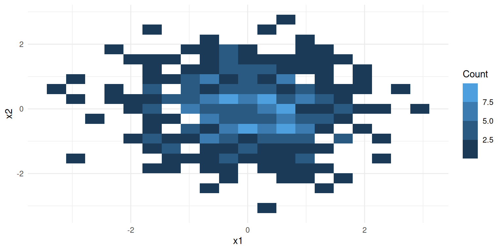
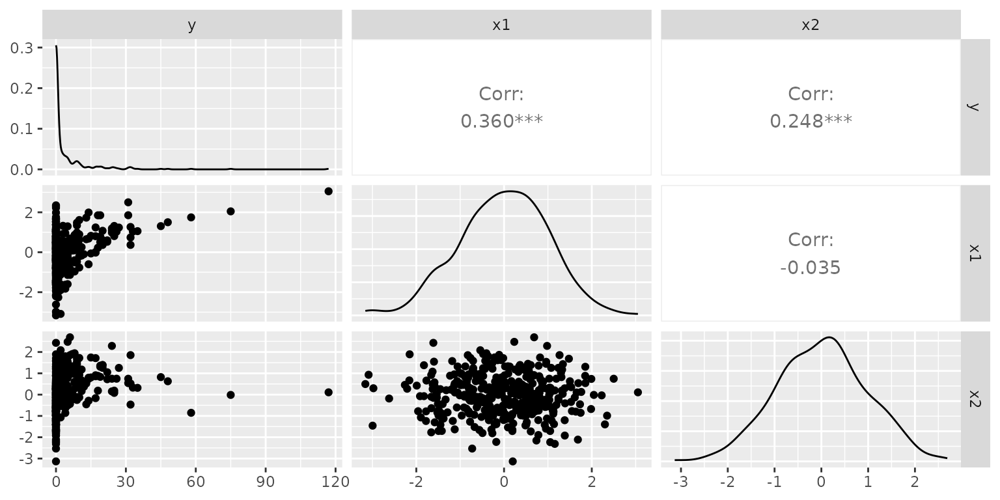
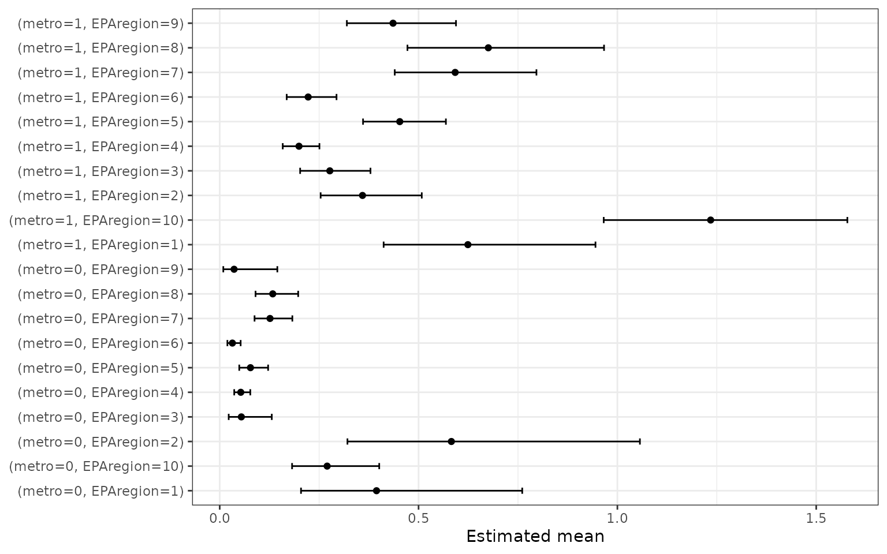
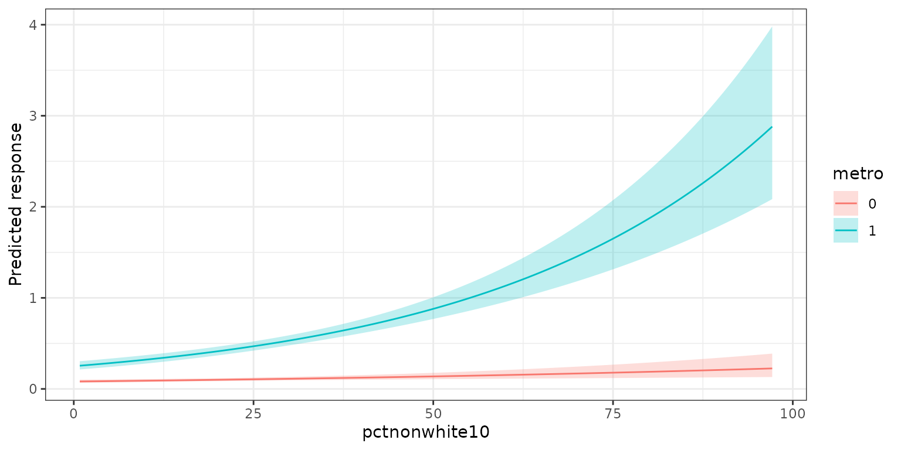
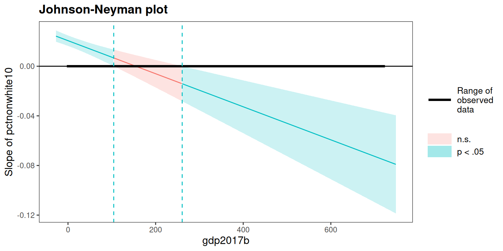

# glmOJ: Count Regression Modeling

``` r
library(glmOJ)
```

## Overview

`glmOJ` provides a streamlined workflow for fitting, diagnosing, and
interpreting count regression models. The six supported families are:

| Function                                                                                 | Model                           |
|------------------------------------------------------------------------------------------|---------------------------------|
| [`poissonGLM()`](http://oscar.jaroker.com/glmOJ/reference/poissonGLM.md)                 | Poisson GLM                     |
| [`negbinGLM()`](http://oscar.jaroker.com/glmOJ/reference/negbinGLM.md)                   | Negative Binomial GLM           |
| [`tweedieGLM()`](http://oscar.jaroker.com/glmOJ/reference/tweedieGLM.md)                 | Tweedie GLM                     |
| [`zeroinflPoissonGLM()`](http://oscar.jaroker.com/glmOJ/reference/zeroinflPoissonGLM.md) | Zero-Inflated Poisson           |
| [`zeroinflNegbinGLM()`](http://oscar.jaroker.com/glmOJ/reference/zeroinflNegbinGLM.md)   | Zero-Inflated Negative Binomial |
| [`zeroinflTweedieGLM()`](http://oscar.jaroker.com/glmOJ/reference/zeroinflTweedieGLM.md) | Zero-Inflated Tweedie           |

A general-purpose wrapper
[`countGLM()`](http://oscar.jaroker.com/glmOJ/reference/countGLM.md)
fits all six and selects the best by a user-chosen criterion (`decide`):
`"BIC"` (default), `"AIC"`, `"LogLik"`, or `"McFadden"` (McFadden
pseudo-R²). Each zero-inflated counterpart (Poisson, Negative Binomial,
Tweedie) is fitted only when the DHARMa zero-inflation test flags its
base model (p \< 0.05).

------------------------------------------------------------------------

## Case Study: Federal Environmental Crime Prosecutions

Greenberg et al. (2026) investigate how environmental and social factors
influence where EPA criminal prosecutions occur across 3,143 US counties
(2011–2020). The response variable `FinalEC` is a count of criminal
prosecutions per county.

``` r
data("Greenberg26.dat")
```

### 1. Data Exploration

Before fitting,
[`summarizeCountData()`](http://oscar.jaroker.com/glmOJ/reference/summarizeCountData.md)
gives a quick numerical and graphical overview of the count response
alongside each predictor.

``` r
summarizeCountData(
  FinalEC ~ eqi_2jan2018_vc +
    pctnonwhite10 +
    metro +
    gdp2017b +
    fac_penalty_count +
    CIDDist +
    EPAregion,
  data = Greenberg26.dat
)
#> $summary
#>        mean       var var_mean_ratio n_zero n_total
#> 1 0.2356564 0.6490525       2.754232   2654    3085
#> 
#> $counts
#>    count freq
#> 1      0 2654
#> 2      1  299
#> 3      2   66
#> 4      3   31
#> 5      4   14
#> 6      5    5
#> 7      6    6
#> 8      7    3
#> 9      8    3
#> 10     9    2
#> 11    11    1
#> 12    12    1
#> 
#> $plot
```


    #> 
    #> $pairs_plot


### 2. Poisson Regression

We first fit a Poisson GLM with the Overall Environmental Quality Index
and demographic/geographic controls.

``` r
mod.pois <- poissonGLM(
  FinalEC ~ eqi_2jan2018_vc +
    pctnonwhite10 +
    metro +
    gdp2017b +
    fac_penalty_count +
    CIDDist +
    EPAregion,
  data = Greenberg26.dat
)
```

#### Coefficients (exponentiated)

``` r
mod.pois$coefficients
#>                 term  exp.coef  lower.95  upper.95      p.value stars
#> 1        (Intercept) 0.1823719 0.1218639 0.2729236 1.304191e-16   ***
#> 2    eqi_2jan2018_vc 1.0587100 0.9554459 1.1731349 2.759131e-01      
#> 3      pctnonwhite10 1.0193442 1.0149745 1.0237327 2.308798e-18   ***
#> 4             metro1 3.3042257 2.7087270 4.0306415 4.500518e-32   ***
#> 5           gdp2017b 1.0020768 1.0013743 1.0027798 6.708917e-09   ***
#> 6  fac_penalty_count 1.0035038 1.0025814 1.0044270 9.019065e-14   ***
#> 7            CIDDist 0.9968844 0.9961277 0.9976416 7.995795e-16   ***
#> 8         EPAregion2 0.6380126 0.4071818 0.9997010 4.984764e-02     *
#> 9         EPAregion3 0.3930124 0.2500571 0.6176939 5.159508e-05   ***
#> 10        EPAregion4 0.3419217 0.2283596 0.5119578 1.880591e-07   ***
#> 11        EPAregion5 0.6331705 0.4259880 0.9411178 2.381632e-02     *
#> 12        EPAregion6 0.3535927 0.2288448 0.5463433 2.826577e-06   ***
#> 13        EPAregion7 0.9194406 0.6000503 1.4088336 6.996862e-01      
#> 14        EPAregion8 0.9845458 0.6244062 1.5524036 9.465543e-01      
#> 15        EPAregion9 0.6802879 0.4344711 1.0651838 9.219375e-02     .
#> 16       EPAregion10 1.6355984 1.0812709 2.4741092 1.980635e-02     *
```

#### Model fit

``` r
mod.pois$diagnostics$plot
```


The dispersion ratio of 1.615 is flagged in red — the observed variance
is ~60% larger than expected under Poisson, suggesting overdispersion.
We also inspect the squared Pearson residual plot:

``` r
mod.pois$diagnostics$r2_plot
```


The wedge shape confirms the mean-variance relationship is not well
captured by the Poisson assumption.

### 3. Negative Binomial Regression

The negative binomial adds a free dispersion parameter $\theta$ to
handle overdispersion.

``` r
mod.nb <- negbinGLM(
  FinalEC ~ eqi_2jan2018_vc +
    pctnonwhite10 +
    metro +
    gdp2017b +
    fac_penalty_count +
    CIDDist +
    EPAregion,
  data = Greenberg26.dat,
  control = stats::glm.control(maxit = 100)
)
```

#### Coefficients (exponentiated)

``` r
mod.nb$coefficients
#>                 term  exp.coef  lower.95  upper.95      p.value stars
#> 1        (Intercept) 0.1739476 0.1009294 0.2997917 3.023453e-10   ***
#> 2    eqi_2jan2018_vc 0.9876521 0.8594207 1.1350166 8.609982e-01      
#> 3      pctnonwhite10 1.0142370 1.0081961 1.0203142 3.518093e-06   ***
#> 4             metro1 2.6619963 2.0970839 3.3790847 8.626855e-16   ***
#> 5           gdp2017b 1.0075352 1.0053273 1.0097479 1.988481e-11   ***
#> 6  fac_penalty_count 1.0095626 1.0068424 1.0122902 4.726959e-12   ***
#> 7            CIDDist 0.9980886 0.9971817 0.9989964 3.709074e-05   ***
#> 8         EPAregion2 0.7248601 0.3804835 1.3809327 3.278330e-01      
#> 9         EPAregion3 0.3342143 0.1793891 0.6226643 5.559635e-04   ***
#> 10        EPAregion4 0.3282850 0.1881526 0.5727855 8.778317e-05   ***
#> 11        EPAregion5 0.5182600 0.2972138 0.9037044 2.051048e-02     *
#> 12        EPAregion6 0.3174128 0.1737298 0.5799287 1.901195e-04   ***
#> 13        EPAregion7 0.7815558 0.4357070 1.4019271 4.083921e-01      
#> 14        EPAregion8 0.9084431 0.4852015 1.7008789 7.641150e-01      
#> 15        EPAregion9 0.5513771 0.2775557 1.0953358 8.914123e-02     .
#> 16       EPAregion10 1.6502074 0.8996619 3.0268976 1.055884e-01
```

#### Model fit

``` r
mod.nb$diagnostics$plot
```


``` r
mod.nb$diagnostics$r2_plot
```


The dispersion ratio is now 1.021 — much closer to 1. The estimated
$\theta$ is 0.649.

### 4. Using the `countGLM` Wrapper

Rather than fitting each model manually,
[`countGLM()`](http://oscar.jaroker.com/glmOJ/reference/countGLM.md)
fits all six families at once and selects the best by the criterion
specified in `decide` (default `"BIC"`) — arriving at the same
conclusion automatically.

#### Overall EQI formula

``` r
result1 <- countGLM(
  FinalEC ~ eqi_2jan2018_vc +
    pctnonwhite10 +
    metro +
    gdp2017b +
    fac_penalty_count +
    CIDDist +
    EPAregion,
  data = Greenberg26.dat
)
print(result1)
#> 
#> Call:
#> countGLM(formula = FinalEC ~ eqi_2jan2018_vc + pctnonwhite10 + 
#>     metro + gdp2017b + fac_penalty_count + CIDDist + EPAregion, 
#>     data = Greenberg26.dat)
#> 
#> Model comparison (sorted by BIC (ascending)):
#>             model     AIC     BIC
#>            negbin 2964.32 3066.90
#>  zeroinfl_poisson 2920.58 3113.67
#>           poisson 3179.45 3276.00
#> 
#> Selected model: negbin
#> 
#> Recommendation:
#>   Negative Binomial was selected by BIC (BIC = 3066.90). The Poisson
#>   dispersion ratio is 1.62 (> 1.2), indicating overdispersion.
#>   Zero-inflation detected for Poisson; corresponding ZI model(s) were
#>   fitted.
```

The wrapper selects the same winner as the manual LRT. Individual fits
remain accessible: `result1$fits$negbin`, `result1$fits$poisson`, etc.

#### Sub-index formula

The researchers also evaluated whether separate Water, Air, Land, and
Socioeconomic indices were more informative than the composite Overall
EQI. `countGLM` handles this in one call:

``` r
result2 <- countGLM(
  FinalEC ~ water_eqi_2jan2018_vc +
    land_eqi_2jan2018_vc +
    air_eqi_2jan2018_vc +
    sociod_eqi_2jan2018_vc +
    pctnonwhite10 +
    metro +
    gdp2017b +
    fac_penalty_count +
    CIDDist +
    EPAregion,
  data = Greenberg26.dat
)
print(result2)
#> 
#> Call:
#> countGLM(formula = FinalEC ~ water_eqi_2jan2018_vc + land_eqi_2jan2018_vc + 
#>     air_eqi_2jan2018_vc + sociod_eqi_2jan2018_vc + pctnonwhite10 + 
#>     metro + gdp2017b + fac_penalty_count + CIDDist + EPAregion, 
#>     data = Greenberg26.dat)
#> 
#> Model comparison (sorted by BIC (ascending)):
#>             model     AIC     BIC
#>            negbin 2953.72 3074.41
#>  zeroinfl_poisson 2933.58 3162.89
#>           poisson 3144.98 3259.64
#> 
#> Selected model: negbin
#> 
#> Recommendation:
#>   Negative Binomial was selected by BIC (BIC = 3074.41). The Poisson
#>   dispersion ratio is 1.49 (> 1.2), indicating overdispersion.
#>   Zero-inflation detected for Poisson; corresponding ZI model(s) were
#>   fitted.
```

Again the negative binomial is selected. The non-nested comparison
between these two winning models (overall EQI vs sub-indices) can be
done with a Vuong test via
`nonnest2::vuongtest(result1$fits$negbin$model, result2$fits$negbin$model)`.

------------------------------------------------------------------------

## 5. Coefficient Interpretation

[`interpret_coef()`](http://oscar.jaroker.com/glmOJ/reference/interpret_coef.md)
translates any exponentiated coefficient into a plain-language
statement, with a 95% CI and an automatic note when the predictor is not
discernible from zero (p \> 0.05).

#### Significant predictor

``` r
interpret_coef(mod.nb, "pctnonwhite10")
#> Holding all other predictors constant, a one-unit increase in pctnonwhite10 is associated with a 1.4% increase in the expected count of FinalEC (exp(β) = 1.014, 95% CI: [1.008, 1.020]).
```

#### Non-significant predictor

``` r
interpret_coef(mod.nb, "eqi_2jan2018_vc")
#> Holding all other predictors constant, a one-unit increase in eqi_2jan2018_vc is associated with a 1.2% decrease in the expected count of FinalEC (exp(β) = 0.988, 95% CI: [0.859, 1.135]).
#> Note: this coefficient is not discernibly different from zero (p = 0.861).
```

The note about discernibility is added automatically.

#### Using with `countGLM`

Pass the `countGLM` result directly — it delegates to the best-fitting
model:

``` r
interpret_coef(result2, "pctnonwhite10")
#> Holding all other predictors constant, a one-unit increase in pctnonwhite10 is associated with a 1.4% increase in the expected count of FinalEC (exp(β) = 1.014, 95% CI: [1.008, 1.020]).
```

#### Zero-inflated models: specifying the component

For zero-inflated models, use `component = "count"` (default) or
`component = "zero"`:

``` r
interpret_coef(zi_fit, "pctnonwhite10", component = "count")
interpret_coef(zi_fit, "pctnonwhite10", component = "zero")
```

------------------------------------------------------------------------

## Case Study 2: Urban Surveillance Camera Counts (Dahir 2025)

Dahir (2025) models the number of surveillance cameras per census tract
across ten US cities. The response `cam_count` is a non-negative integer
with 87.6% zeros and a variance-to-mean ratio of approximately 3.6, a
warning sign that a standard Poisson model may fit poorly.

``` r
data("Dahir25.dat")
```

### 6. Data Exploration

``` r
summarizeCountData(
  cam_count ~ total_crime_rate + hinc + modal_zone + pvac,
  data = Dahir25.dat
)
#> $summary
#>        mean       var var_mean_ratio n_zero n_total
#> 1 0.2172117 0.7840397       3.609565  10177   11620
#> 
#> $counts
#>    count  freq
#> 1      0 10177
#> 2      1   977
#> 3      2   257
#> 4      3    97
#> 5      4    44
#> 6      5    20
#> 7      6    14
#> 8      7     8
#> 9      8     4
#> 10     9     5
#> 11    10     5
#> 12    11     2
#> 13    13     3
#> 14    15     1
#> 15    17     1
#> 16    19     1
#> 17    21     2
#> 18    22     1
#> 19    23     1
#> 
#> $plot
```


    #> 
    #> $pairs_plot


Camera placement varies substantially by land-use zone — mixed and
industrial tracts have cameras in roughly 28–42% of cases, while
residential tracts (the majority, n = 8913) have cameras in fewer than
10%. This mixture of structurally camera-free tracts alongside genuinely
high-count commercial zones is exactly the setting where zero-inflated
or overdispersed count models are needed.

### 7. Poisson and Zero-Inflated Poisson

We may want to start by manually fitting a Poisson model to confirm the
overdispersion and zero-inflation intuition. The formula includes a
quadratic term for each predictor to allow for non-linear effects, and
road length is included as an offset:

``` r
pois.cam <- poissonGLM(
  cam_count ~ pnhwht +
    pnhblk +
    entropy_rank +
    total_crime_rate +
    modal_zone +
    pop +
    hinc +
    pvac +
    mhmval +
    city +
    offset(log_road_length) +
    I(pnhwht^2) +
    I(pnhblk^2) +
    I(entropy_rank^2),
  data = Dahir25.dat
)
#> Warning: Possible zero-inflation detected by DHARMa test (p = 0.000). Consider
#> zeroinflPoissonGLM(), zeroinflNegbinGLM(), or zeroinflTweedieGLM().
print(pois.cam)
#> 
#> Call:
#> poissonGLM(formula = cam_count ~ pnhwht + pnhblk + entropy_rank + 
#>     total_crime_rate + modal_zone + pop + hinc + pvac + mhmval + 
#>     city + offset(log_road_length) + I(pnhwht^2) + I(pnhblk^2) + 
#>     I(entropy_rank^2), data = Dahir25.dat)
#> 
#> Model family: poissonGLM 
#> 
#> Coefficients (on response scale):
#>                   term exp.coef lower.95 upper.95 p.value stars
#>            (Intercept)   0.1337   0.1055   0.1695  0.0000   ***
#>                 pnhwht   0.9634   0.8968   1.0349  0.3067      
#>                 pnhblk   0.8723   0.8106   0.9387  0.0003   ***
#>           entropy_rank   1.4478   0.7754   2.7031  0.2454      
#>       total_crime_rate   1.0908   1.0796   1.1022  0.0000   ***
#>   modal_zoneindustrial   1.1534   0.9558   1.3917  0.1366      
#>        modal_zonemixed   1.2535   1.0415   1.5087  0.0168     *
#>       modal_zonepublic   0.5876   0.4649   0.7428  0.0000   ***
#>  modal_zoneresidential   0.4298   0.3742   0.4937  0.0000   ***
#>        modal_zoneroads   0.6960   0.4447   1.0895  0.1130      
#>                    pop   1.1213   1.0990   1.1442  0.0000   ***
#>                   hinc   0.7716   0.7305   0.8149  0.0000   ***
#>                   pvac   1.1807   1.1373   1.2258  0.0000   ***
#>                 mhmval   1.1586   1.1036   1.2164  0.0000   ***
#>             cityBoston   1.2368   1.0563   1.4481  0.0083    **
#>            cityChicago   0.1851   0.1546   0.2216  0.0000   ***
#>        cityLos Angeles   0.0495   0.0399   0.0615  0.0000   ***
#>          cityMilwaukee   0.3249   0.2688   0.3927  0.0000   ***
#>           cityNew York   0.2073   0.1776   0.2421  0.0000   ***
#>       cityPhiladelphia   0.4482   0.3808   0.5274  0.0000   ***
#>      citySan Francisco   0.6071   0.5090   0.7241  0.0000   ***
#>            citySeattle   0.1768   0.1440   0.2171  0.0000   ***
#>         cityWashington   0.4568   0.3008   0.6937  0.0002   ***
#>            I(pnhwht^2)   1.0487   0.9979   1.1020  0.0607     .
#>            I(pnhblk^2)   1.0139   0.9881   1.0402  0.2939      
#>      I(entropy_rank^2)   1.2363   0.7094   2.1546  0.4541      
#> 
#> Dispersion ratio: 1.8401
#> AIC: 11299.96
```

The DHARMa zero-inflation test result:

``` r
zi <- pois.cam$diagnostics$zi_test
cat(sprintf(
  "DHARMa zero-inflation test: p = %.4f  |  Detected: %s\n",
  zi$p_value,
  zi$detected
))
#> DHARMa zero-inflation test: p = 0.0000  |  Detected: TRUE
zi$plot
```


### 8. Automatic Model Selection with `countGLM`

[`countGLM()`](http://oscar.jaroker.com/glmOJ/reference/countGLM.md)
fits all six count families and selects the best by the criterion in
`decide` (default `"BIC"`). Road length (`log_road_length`) is included
as an offset in the count component; because `ziformula = NULL`, it is
automatically applied to the zero-inflation component as well —
`countGLM` prints a note confirming this:

``` r
result_cam <- countGLM(
  cam_count ~ pnhblk +
    pnhwht +
    total_crime_rate +
    hinc +
    pvac +
    modal_zone +
    offset(log_road_length),
  data = Dahir25.dat
)
print(result_cam)
#> 
#> Call:
#> countGLM(formula = cam_count ~ pnhblk + pnhwht + total_crime_rate + 
#>     hinc + pvac + modal_zone + offset(log_road_length), data = Dahir25.dat)
#> 
#> Model comparison (sorted by BIC (ascending)):
#>             model      AIC      BIC
#>            negbin 11306.16 11394.49
#>           tweedie 11493.07 11588.75
#>  zeroinfl_poisson 11791.50 11953.43
#>           poisson 13201.10 13282.07
#> 
#> Selected model: negbin
#> 
#> Recommendation:
#>   Negative Binomial was selected by BIC (BIC = 11394.49). The Poisson
#>   dispersion ratio is 2.42 (> 1.2), indicating overdispersion.
#>   Zero-inflation detected for Poisson and Tweedie; corresponding ZI
#>   model(s) were fitted.
```

The comparison table shows AIC and BIC for all six families, sorted by
the selection criterion. The selected model is **negbin**. The
recommendation captures the relevant dispersion and zero-inflation
diagnostics automatically, explaining why this family was preferred.

### 9. Checking for Multicollinearity (VIF)

All four model families share the assumption that predictors are not
strongly collinear.
[`countGLM()`](http://oscar.jaroker.com/glmOJ/reference/countGLM.md)
automatically computes Variance Inflation Factors and stores them in
`$vif`. To avoid false positives from *structural* collinearity — which
is expected whenever interaction or polynomial terms are present — VIF
is computed on an OLS model that retains only the order-1 (main-effect)
terms from the formula. Offset terms are excluded as well.

``` r
result_cam$vif
#>                pnhblk                pnhwht      total_crime_rate 
#>              1.696259              2.292616              1.152382 
#>                  hinc                  pvac  modal_zoneindustrial 
#>              1.592488              1.093179              1.115794 
#>       modal_zonemixed      modal_zonepublic modal_zoneresidential 
#>              1.101121              1.151036              1.495288 
#>       modal_zoneroads 
#>              1.145420
```

VIF = 1 means a predictor is uncorrelated with all others; values up to
~5 are generally acceptable. Any VIF \> 5 triggers a warning. Here all
predictors are well below that threshold, confirming that
multicollinearity is not a concern for this model.

To illustrate the interaction-term handling, fitting the Poisson model
with a quadratic term does **not** inflate the VIF for the underlying
predictors:

``` r
result_quad <- suppressWarnings(countGLM(
  cam_count ~ pnhblk +
    pnhwht +
    total_crime_rate +
    I(total_crime_rate^2) +
    offset(log_road_length),
  data = Dahir25.dat
))
result_quad$vif # only main-effect terms: pnhblk, pnhwht, total_crime_rate
#>                pnhblk                pnhwht      total_crime_rate 
#>              1.683595              1.637775              1.726555 
#> I(total_crime_rate^2) 
#>              1.648745
```

### 10. Interpreting the Winning Model

[`interpret_coef()`](http://oscar.jaroker.com/glmOJ/reference/interpret_coef.md)
delegates to the best-fitting model automatically:

``` r
interpret_coef(result_cam, "total_crime_rate")
#> Holding all other predictors constant, a one-unit increase in total_crime_rate is associated with a 39.2% increase in the expected rate of cam_count per unit of exposure (exp(β) = 1.392, 95% CI: [1.333, 1.455]).
```

``` r
interpret_coef(result_cam, "hinc")
#> Holding all other predictors constant, a one-unit increase in hinc is associated with a 19.5% decrease in the expected rate of cam_count per unit of exposure (exp(β) = 0.805, 95% CI: [0.744, 0.871]).
```

For zero-inflated models, the count and zero components can be
interpreted separately. The count component describes the expected
camera count among tracts that are in the counting process; the zero
component describes the odds of being a structural zero (a tract that
never receives a camera):

``` r
interpret_coef(result_cam, "total_crime_rate", component = "count")
interpret_coef(result_cam, "total_crime_rate", component = "zero")
```

------------------------------------------------------------------------

## Case Study 3: Zero-Inflated Tweedie (Simulated Count Data)

The `ZITweedie.dat` dataset illustrates when
[`zeroinflTweedieGLM()`](http://oscar.jaroker.com/glmOJ/reference/zeroinflTweedieGLM.md)
is the appropriate model. The response `y` is a non-negative integer
count simulated from a compound Poisson-Gamma (Tweedie, $p = 1.5$,
$\phi = 2.0$) with structural zeros added on top. The true model has two
independent predictors: `x1` drives the count mean and `x2` drives
zero-inflation.

``` r
data("ZITweedie.dat")
```

### 11. Data Exploration

``` r
summarizeCountData(y ~ x1 + x2, data = ZITweedie.dat)
#> $summary
#>   mean      var var_mean_ratio n_zero n_total
#> 1 4.13 105.2011       25.47242    244     400
#> 
#> $counts
#>    count freq
#> 1      0  244
#> 2      1   18
#> 3      2   19
#> 4      3   15
#> 5      4   12
#> 6      5   14
#> 7      6    6
#> 8      7    4
#> 9      8    7
#> 10     9   10
#> 11    10    6
#> 12    11    4
#> 13    12    1
#> 14    13    2
#> 15    14    3
#> 16    15    2
#> 17    17    4
#> 18    18    2
#> 19    19    3
#> 20    20    3
#> 21    22    2
#> 22    24    3
#> 23    25    2
#> 24    26    1
#> 25    27    1
#> 26    31    2
#> 27    32    3
#> 28    33    1
#> 29    35    1
#> 30    45    1
#> 31    48    1
#> 32    58    1
#> 33    75    1
#> 34   117    1
#> 
#> $plot
```



    #> 
    #> $pairs_plot



The frequency table is dominated by zeros (~57%), and the variance far
exceeds the mean — both signs that a standard Poisson or negative
binomial model will fit poorly.

### 12. Automatic Model Selection with `countGLM`

[`countGLM()`](http://oscar.jaroker.com/glmOJ/reference/countGLM.md)
fits the three base families and then fits each zero-inflated
counterpart only when the DHARMa zero-inflation test flags its base
model (p \< 0.05). AIC/BIC then arbitrates among whichever models were
fit.

``` r
result_zitw <- suppressWarnings(
  countGLM(y ~ x1 + x2, data = ZITweedie.dat)
)
print(result_zitw)
#> 
#> Call:
#> countGLM(formula = y ~ x1 + x2, data = ZITweedie.dat)
#> 
#> Model comparison (sorted by BIC (ascending)):
#>             model     AIC     BIC
#>           tweedie 1433.70 1453.66
#>            negbin 1462.02 1477.98
#>  zeroinfl_poisson 1649.58 1673.53
#>           poisson 3393.04 3405.02
#> 
#> Selected model: tweedie
#> 
#> Recommendation:
#>   Tweedie was selected by BIC (BIC = 1453.66). The Poisson dispersion
#>   ratio is 8.97 (> 1.2), indicating overdispersion. Zero-inflation
#>   detected for Poisson; corresponding ZI model(s) were fitted.
```

### 13. Fitting Zero-Inflated Tweedie Directly

[`zeroinflTweedieGLM()`](http://oscar.jaroker.com/glmOJ/reference/zeroinflTweedieGLM.md)
can also be called directly, which is useful when the ZI predictor
differs from the count predictor. Here the true ZI predictor is `x2`, so
we supply it via `ziformula`:

``` r
fit_zitw <- suppressWarnings(
  zeroinflTweedieGLM(y ~ x1, data = ZITweedie.dat, ziformula = ~x2)
)
print(fit_zitw)
#> 
#> Call:
#> zeroinflTweedieGLM(formula = y ~ x1, data = ZITweedie.dat, ziformula = ~x2)
#> 
#> Model family: zeroinflTweedieGLM
#> 
#> Count component (exponentiated coefficients):
#>         term exp.coef lower.95 upper.95 p.value stars
#>  (Intercept)   6.3374   5.4737   7.3373       0   ***
#>           x1   2.4419   2.1786   2.7369       0   ***
#> 
#> Zero-inflation component (exponentiated coefficients):
#>         term exp.coef lower.95 upper.95 p.value stars
#>  (Intercept)   1.3416   0.9467   1.9010  0.0985     .
#>           x2   0.0904   0.0485   0.1682  0.0000   ***
#> 
#> Dispersion (phi): 2.4293
#> Power (p): 1.3366
#> Dispersion ratio: 0.8916
#> AIC: 1305.57
```

### 14. Interpreting Both Components

The count component describes the expected count among observations that
are not structural zeros; the zero component describes the odds of being
a structural zero.

``` r
interpret_coef(fit_zitw, "x1", component = "count")
#> Holding all other predictors constant, a one-unit increase in x1 is associated with a 144.2% increase in the expected value of y (among non-structural zeros) (exp(β) = 2.442, 95% CI: [2.179, 2.737]).
```

``` r
interpret_coef(fit_zitw, "x2", component = "zero")
#> Holding all other predictors constant, a one-unit increase in x2 is associated with a 91.0% decrease in the odds of being a structural zero (exp(β) = 0.090, 95% CI: [0.049, 0.168]).
```

The estimated $\widehat{p}$ (1.337) is well within (1, 2), confirming
the Tweedie family is appropriate. The estimated $\widehat{\phi}$ is
2.429.

------------------------------------------------------------------------

## Untangling Interactions

A single coefficient is not enough to describe an interaction: the
effect of one predictor depends on the value of another.
[`untangle_interaction()`](http://oscar.jaroker.com/glmOJ/reference/untangle_interaction.md)
produces the right post-hoc summary for each case — categorical ×
categorical, categorical × continuous, or continuous × continuous — in
one call. It accepts any model fit returned by the package (or a raw
`glm` / `glmmTMB` object) and a pair of interacting variables.

By default the function does **not** average over any *categorical*
predictor outside the interaction of interest; each level is reported
separately. Continuous controls are held at their mean (the `emmeans`
default). Pass names to `average.over` to collapse specific categorical
predictors.

We return to the Greenberg environmental-crime data and fit three
variants of the Poisson model, each with a different interaction, to
illustrate the three cases.

### 15. Categorical × Categorical: `metro * EPAregion`

Does the metro/non-metro contrast look the same across EPA regions?

``` r
fit_cc <- poissonGLM(
  FinalEC ~ metro * EPAregion + eqi_2jan2018_vc + pctnonwhite10 + gdp2017b,
  data = Greenberg26.dat
)

res_cc <- untangle_interaction(fit_cc, c("metro", "EPAregion"))
#> Interaction metro x EPAregion (categorical x categorical).
#> 'emmeans' holds estimated marginal means for every combination of the two factors. Columns: Mean = EMM on the response scale, Lower/Upper = 95% confidence bounds. 'plot' contains a faceted ggplot of the means with 95% error bars.
head(res_cc$emmeans, 10)
#>  metro EPAregion      Mean         SE  df     Lower     Upper
#>  0     1         0.3943082 0.13219689 Inf 0.2043899 0.7606976
#>  1     1         0.6240832 0.13208135 Inf 0.4121865 0.9449119
#>  0     2         0.5825585 0.17697119 Inf 0.3211880 1.0566225
#>  1     2         0.3590851 0.06358512 Inf 0.2537877 0.5080707
#>  0     3         0.0543746 0.02437263 Inf 0.0225869 0.1308985
#>  1     3         0.2768718 0.04438896 Inf 0.2022141 0.3790933
#>  0     4         0.0529480 0.01006407 Inf 0.0364802 0.0768496
#>  1     4         0.1993390 0.02332805 Inf 0.1584815 0.2507297
#>  0     5         0.0773253 0.01789516 Inf 0.0491282 0.1217062
#>  1     5         0.4527369 0.05269071 Inf 0.3603967 0.5687363
#> 
#> Confidence level used: 0.95 
#> Intervals are back-transformed from the log scale
```

`Mean` is the estimated marginal mean on the response scale (expected
count per county); `Lower`/`Upper` are 95% confidence bounds. Comparing
`Mean` across `metro` within each `EPAregion` shows how the metro effect
varies by region. The companion plot shows every cell-mean with its 95%
error bar (and is faceted by any categorical predictor left unaveraged —
here there are none, so a single panel is drawn):

``` r
res_cc$plot
```



### 16. Categorical × Continuous: `metro * pctnonwhite10`

How does the effect of percent-non-white-population differ between metro
and non-metro counties? For this case
[`untangle_interaction()`](http://oscar.jaroker.com/glmOJ/reference/untangle_interaction.md)
returns two pieces:

1.  `emtrends` — the slope of the continuous predictor at each level of
    the factor (on the linear-predictor / link scale).
2.  `plot` — a faceted `ggplot` of predicted responses across 100 evenly
    spaced values of the continuous predictor, coloured by the factor.
    Facets are combinations of any categorical predictor *not* in
    `average.over` and *not* in the interaction.

First, leave every other categorical predictor in the model unaveraged.
`EPAregion` has 10 levels, which would exceed the 8-facet limit, so the
plot is suppressed with a warning:

``` r
fit_xc <- poissonGLM(
  FinalEC ~ metro * pctnonwhite10 + eqi_2jan2018_vc + gdp2017b + EPAregion,
  data = Greenberg26.dat
)

res_xc_warn <- untangle_interaction(fit_xc, c("metro", "pctnonwhite10"))
#> Interaction metro (categorical) x pctnonwhite10 (continuous).
#> 'emtrends' gives the slope of pctnonwhite10 at each level of metro on the linear predictor scale: a one-unit increase in pctnonwhite10 shifts the linear predictor by 'Slope' units. Slopes whose CI excludes zero are discernible from zero. Plot suppressed: 10 facet panels exceed the limit of 8. Re-run with overridePlot = TRUE to force it. Facets are combinations of EPAregion.
res_xc_warn$emtrends
#>  metro EPAregion      Slope          SE  df       Lower      Upper z.ratio
#>  0     1         0.01047499 0.003521538 Inf 0.003572898 0.01737707   2.975
#>  1     1         0.02517181 0.002380665 Inf 0.020505787 0.02983782  10.573
#>  0     2         0.01047499 0.003521538 Inf 0.003572898 0.01737707   2.975
#>  1     2         0.02517181 0.002380665 Inf 0.020505787 0.02983782  10.573
#>  0     3         0.01047499 0.003521538 Inf 0.003572898 0.01737707   2.975
#>  1     3         0.02517181 0.002380665 Inf 0.020505787 0.02983782  10.573
#>  0     4         0.01047499 0.003521538 Inf 0.003572898 0.01737707   2.975
#>  1     4         0.02517181 0.002380665 Inf 0.020505787 0.02983782  10.573
#>  0     5         0.01047499 0.003521538 Inf 0.003572898 0.01737707   2.975
#>  1     5         0.02517181 0.002380665 Inf 0.020505787 0.02983782  10.573
#>  0     6         0.01047499 0.003521538 Inf 0.003572898 0.01737707   2.975
#>  1     6         0.02517181 0.002380665 Inf 0.020505787 0.02983782  10.573
#>  0     7         0.01047499 0.003521538 Inf 0.003572898 0.01737707   2.975
#>  1     7         0.02517181 0.002380665 Inf 0.020505787 0.02983782  10.573
#>  0     8         0.01047499 0.003521538 Inf 0.003572898 0.01737707   2.975
#>  1     8         0.02517181 0.002380665 Inf 0.020505787 0.02983782  10.573
#>  0     9         0.01047499 0.003521538 Inf 0.003572898 0.01737707   2.975
#>  1     9         0.02517181 0.002380665 Inf 0.020505787 0.02983782  10.573
#>  0     10        0.01047499 0.003521538 Inf 0.003572898 0.01737707   2.975
#>  1     10        0.02517181 0.002380665 Inf 0.020505787 0.02983782  10.573
#>  p.value
#>   0.0029
#>  <0.0001
#>   0.0029
#>  <0.0001
#>   0.0029
#>  <0.0001
#>   0.0029
#>  <0.0001
#>   0.0029
#>  <0.0001
#>   0.0029
#>  <0.0001
#>   0.0029
#>  <0.0001
#>   0.0029
#>  <0.0001
#>   0.0029
#>  <0.0001
#>   0.0029
#>  <0.0001
#> 
#> Confidence level used: 0.95
is.null(res_xc_warn$plot)
#> [1] TRUE
```

Averaging over `EPAregion` removes the facets and the plot is built
normally:

``` r
res_xc <- untangle_interaction(
  fit_xc,
  c("metro", "pctnonwhite10"),
  average.over = "EPAregion"
)
#> Interaction metro (categorical) x pctnonwhite10 (continuous).
#> 'emtrends' gives the slope of pctnonwhite10 at each level of metro on the linear predictor scale: a one-unit increase in pctnonwhite10 shifts the linear predictor by 'Slope' units. Slopes whose CI excludes zero are discernible from zero. 'plot' contains the faceted ggplot of predicted responses vs the continuous predictor, coloured by the factor.
res_xc$emtrends
#>  metro      Slope          SE  df       Lower      Upper z.ratio p.value
#>  0     0.01047499 0.003521538 Inf 0.003572898 0.01737707   2.975  0.0029
#>  1     0.02517181 0.002380665 Inf 0.020505787 0.02983782  10.573 <0.0001
#> 
#> Results are averaged over the levels of: EPAregion 
#> Confidence level used: 0.95
res_xc$plot
```



If we want every region retained despite exceeding the facet limit, we
can set `overridePlot = TRUE`:

``` r
untangle_interaction(
  fit_xc,
  c("metro", "pctnonwhite10"),
  overridePlot = TRUE
)
```

### 17. Continuous × Continuous: `pctnonwhite10 * gdp2017b`

For two continuous predictors
[`untangle_interaction()`](http://oscar.jaroker.com/glmOJ/reference/untangle_interaction.md)
returns:

1.  Two `emtrends_*` data frames — the slope of each predictor at low
    (mean − SD), medium (mean), and high (mean + SD) values of the
    other.
2.  Two `johnson_neyman_*` objects — the range of the moderator over
    which the focal slope is statistically discernible, computed via
    `interactions::johnson_neyman()` with FDR control.

``` r
fit_nn <- poissonGLM(
  FinalEC ~ pctnonwhite10 * gdp2017b + metro + EPAregion,
  data = Greenberg26.dat
)

res_nn <- untangle_interaction(fit_nn, c("pctnonwhite10", "gdp2017b"))
#> Interaction pctnonwhite10 x gdp2017b (continuous x continuous).
#> 'emtrends_pctnonwhite10' gives the slope of pctnonwhite10 at (mean - SD), mean, and (mean + SD) values of gdp2017b: Slope is the change in the linear predictor for a one-unit increase in pctnonwhite10.
#> 'emtrends_gdp2017b' gives the slope of gdp2017b at (mean - SD), mean, and (mean + SD) values of pctnonwhite10 (analogous).
#> 'johnson_neyman_pctnonwhite10_by_gdp2017b' reports the range of gdp2017b values over which the slope of pctnonwhite10 on the linear predictor is statistically discernible (control.fdr = TRUE). 'johnson_neyman_gdp2017b_by_pctnonwhite10' is the swapped version.
head(res_nn$emtrends_pctnonwhite10)
#>  pctnonwhite10  gdp2017b metro EPAregion      Slope          SE  df      Lower
#>       21.49412 -21.20523 0     1         0.02341994 0.002157683 Inf 0.01919096
#>       21.49412   6.24597 0     1         0.01976318 0.002040094 Inf 0.01576467
#>       21.49412  33.69717 0     1         0.01610642 0.002159178 Inf 0.01187451
#>       21.49412 -21.20523 1     1         0.02341994 0.002157683 Inf 0.01919096
#>       21.49412   6.24597 1     1         0.01976318 0.002040094 Inf 0.01576467
#>       21.49412  33.69717 1     1         0.01610642 0.002159178 Inf 0.01187451
#>       Upper z.ratio p.value
#>  0.02764892  10.854 <0.0001
#>  0.02376169   9.687 <0.0001
#>  0.02033833   7.460 <0.0001
#>  0.02764892  10.854 <0.0001
#>  0.02376169   9.687 <0.0001
#>  0.02033833   7.460 <0.0001
#> 
#> Confidence level used: 0.95
head(res_nn$emtrends_gdp2017b)
#>  gdp2017b pctnonwhite10 metro EPAregion       Slope           SE  df
#>  6.245968       1.73973 0     1         0.011563908 0.0014552067 Inf
#>  6.245968      21.49412 0     1         0.008932436 0.0009665720 Inf
#>  6.245968      41.24851 0     1         0.006300964 0.0005152422 Inf
#>  6.245968       1.73973 1     1         0.011563908 0.0014552067 Inf
#>  6.245968      21.49412 1     1         0.008932436 0.0009665720 Inf
#>  6.245968      41.24851 1     1         0.006300964 0.0005152422 Inf
#>        Lower      Upper z.ratio p.value
#>  0.008711756 0.01441606   7.947 <0.0001
#>  0.007037990 0.01082688   9.241 <0.0001
#>  0.005291108 0.00731082  12.229 <0.0001
#>  0.008711756 0.01441606   7.947 <0.0001
#>  0.007037990 0.01082688   9.241 <0.0001
#>  0.005291108 0.00731082  12.229 <0.0001
#> 
#> Confidence level used: 0.95
```

Johnson-Neyman intervals describe the range of the moderator over which
the focal slope is statistically discernible. Printing an object gives
the numerical summary and renders the shaded-region plot; each object
also carries a `$plot` element you can extract separately:

``` r
res_nn$johnson_neyman_pctnonwhite10_by_gdp2017b
#> JOHNSON-NEYMAN INTERVAL
#> 
#> When gdp2017b is OUTSIDE the interval [104.37, 260.64], the slope of
#> pctnonwhite10 is p < .05.
#> 
#> Note: The range of observed values of gdp2017b is [0.01, 720.84]
#> 
#> Interval calculated using false discovery rate adjusted t = 2.06
```



The interval shows that the slope of `pctnonwhite10` is significant (p
\< .05) when `gdp2017b` is **outside** roughly \[104, 261\] — meaning
the race–prosecution relationship is detectable in both low- and
high-GDP counties, but washes out at intermediate values. The reversed
call (focal = `gdp2017b`) is in
`res_nn$johnson_neyman_gdp2017b_by_pctnonwhite10`.

If the continuous predictors have already been standardized (mean 0, SD
1), pass `standardized = TRUE` so the low/medium/high grid uses
`-1, 0, 1` and the interpretation text refers to a
“one-standard-deviation increase” rather than a “one-unit increase”.

------------------------------------------------------------------------

## References

Dahir, Abdi Latif. 2025. “Surveillance Camera Placement and Urban
Inequality.” Working paper.

Greenberg, Pierce, Erik W Johnson, Jennifer Schwartz, and Rylie
Wartinger. 2026. “Social Factors Shape Federal Environmental Crime
Prosecution Patterns in the USA.” *Nature Sustainability*, 1–5.
